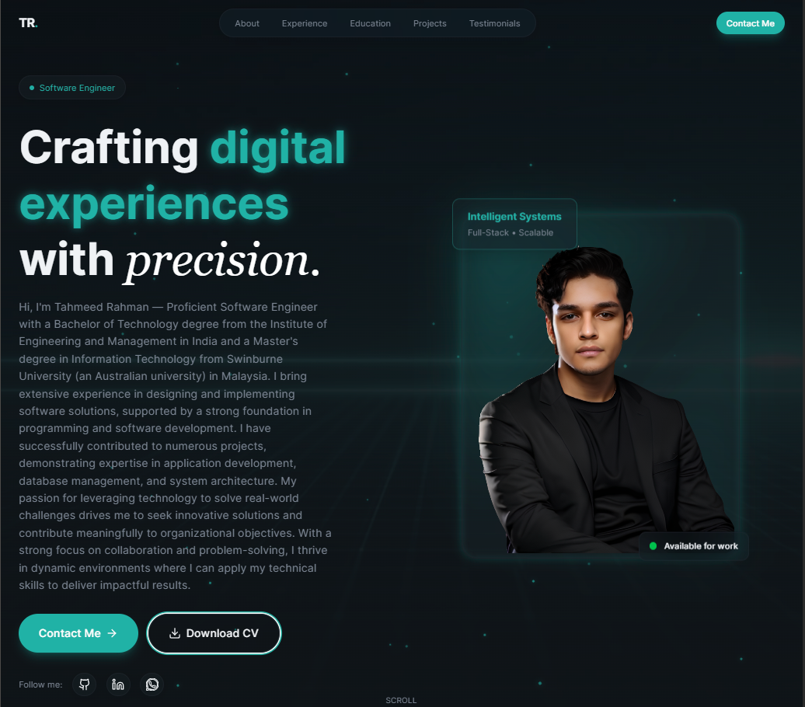

<!-- PROFILE HEADER -->

  

  <h1 align="center">Tahmeed Rahman</h1>

  

    <strong>Full-Stack Engineer • AI & Machine Learning • Problem Solver</strong>
     
    <em>Building intelligent systems that simplify lives and solve real-world challenges.</em>
      
    <a href="https://github.com/TahmeedWolf?tab=repositories">
      <strong>Explore Projects →</strong>
    </a>
    &nbsp;•&nbsp;
    <a href="mailto:rahmantahmeed@gmail.com">
      rahmantahmeed@gmail.com
    </a>
    &nbsp;•&nbsp;
    <a href="https://www.linkedin.com/in/tahmeed-rahman-365863184/">
      LinkedIn
    </a>
    &nbsp;•&nbsp;
    <a href="https://github.com/TahmeedWolf">
      GitHub
    </a>
  

 

<!-- HERO IMAGE -->

  

<!-- ABOUT ME -->
## About Me

I'm Tahmeed Rahman — a passionate full-stack engineer who turns complex challenges into elegant, intelligent solutions.

What excites me most is the moment when technology stops being just code and starts genuinely helping people — whether it's answering loan questions in seconds for microfinance users, predicting financial balances to guide better decisions, or creating assistants that feel almost human.

My journey has taken me from hospital internships to leading AI projects in microfinance and beyond — across Bangladesh, Malaysia, and more. Right now I'm open to **full-time and contract opportunities** (remote or on-site) where I can bring AI, full-stack engineering, and cross-domain problem-solving to create real impact.

<!-- TECH STACK -->
## Tech Stack

  

    <strong>Programming Languages</strong> 
    
    
    
    
    
    JSX • XML
  

  

    <strong>Frameworks & Libraries</strong> 
    
    
    
    
  

  

    <strong>Databases</strong> 
    
    
    
    
  

  

    <strong>Cloud & DevOps</strong> 
    
    
  

  <strong>Web Development</strong> 
  Full-Stack Web Development ⚙️ • Responsive Design 📱 • RESTful Applications 🔗

  <strong>Artificial Intelligence & ML</strong> 
  LLMs 🤖 • Ollama • AI Application Development • Model Training • Deep Learning 🧠

  <strong>Software Engineering Practices</strong> 
  Agile 🔄 • Scrum • REST APIs • Debugging 🔍 • Problem Solving 🛠️

  

    <strong>Design & Multimedia</strong> 
    
   UI/UX Design 🎨 • Graphic Design • Adobe Premiere Pro 🎥
  

 

<!-- FEATURED PROJECTS -->
## Featured Projects

### Personalized Healthcare Management System
Chronic disease platform integrating EHRs, CGM data, and user uploads with AI insights and Knowledge Graph analysis.

**Tech** — Flask • Python • Neo4j • OpenAI • SQLAlchemy • Pandas

### ASA AI Agent
Natural-language interface for microfinance queries — converts plain English to optimized SQL with semantic caching.

**Tech** — Python • Flask • PostgreSQL • NLP • NL-to-SQL

### ASA Prediction System
Hybrid forecasting pipeline (SARIMA + XGBoost) for monthly financial balances with automated SQL ingestion and visualization.

**Tech** — Python • SARIMA • XGBoost • SQLAlchemy • Pandas • Statsmodels

### JARVIS – Voice Assistant
Voice-activated assistant using speech recognition and synthesis for tasks and real-time information.

**Tech** — JavaScript • Web Speech API • HTML/CSS

### CodeFlow
Responsive AI-powered website providing development solutions and tools.

**Tech** — React • JavaScript • Tailwind CSS

→ [See all repositories →](https://github.com/TahmeedWolf?tab=repositories)

 

<!-- LET'S CONNECT -->
## Let's Connect

I'm always open to interesting opportunities, collaborations, or just a good conversation about AI, full-stack, or tech in general.

- **Email** → [rahmantahmeed@gmail.com](mailto:rahmantahmeed@gmail.com)
- **LinkedIn** → [Tahmeed Rahman](https://www.linkedin.com/in/tahmeed-rahman-365863184/)
- **GitHub** → [@TahmeedWolf](https://github.com/TahmeedWolf)

(<a href="#readme-top">back to top ↑</a>)
